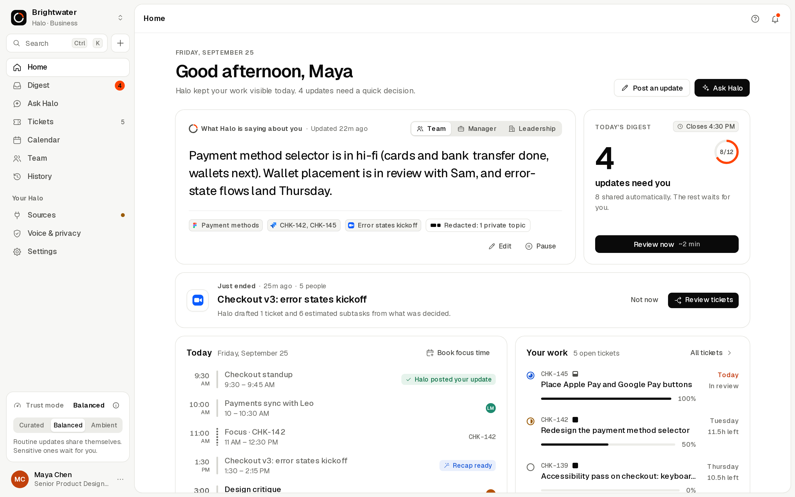
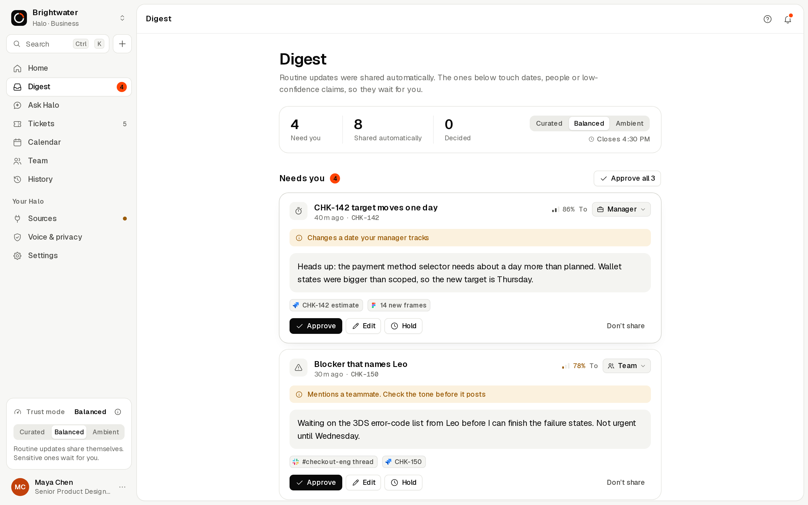
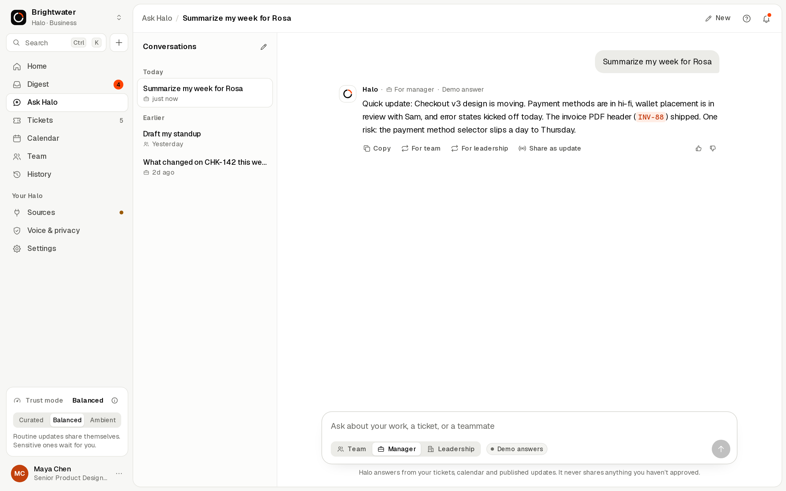
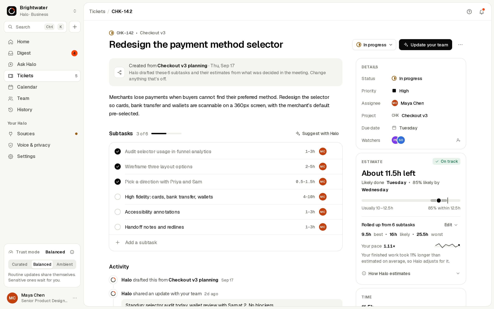
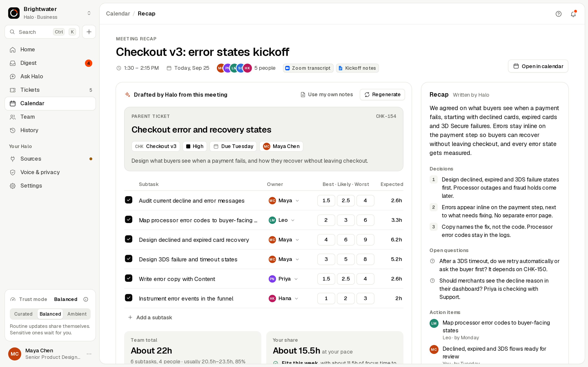
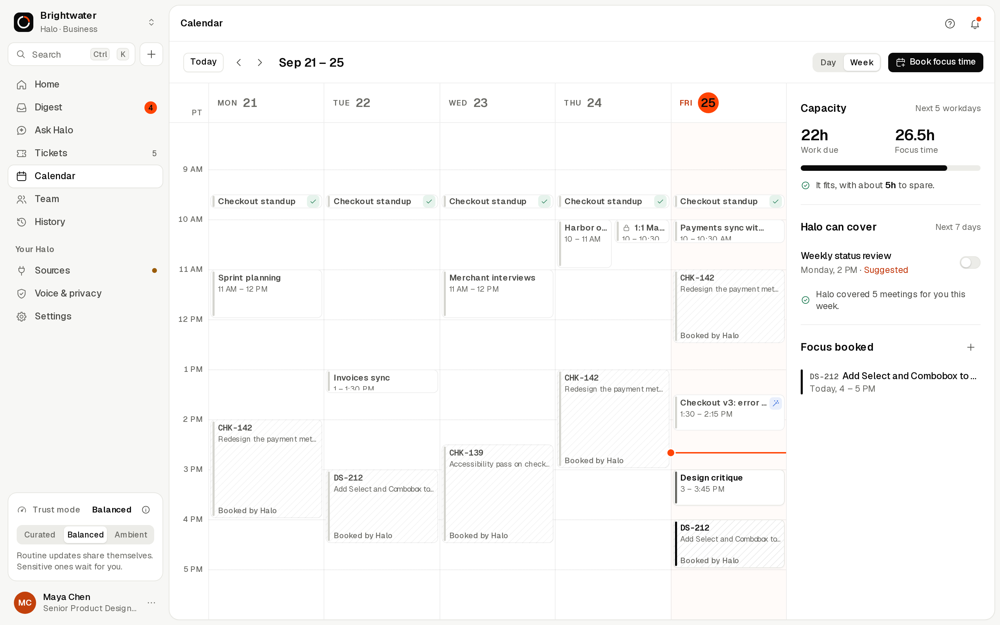
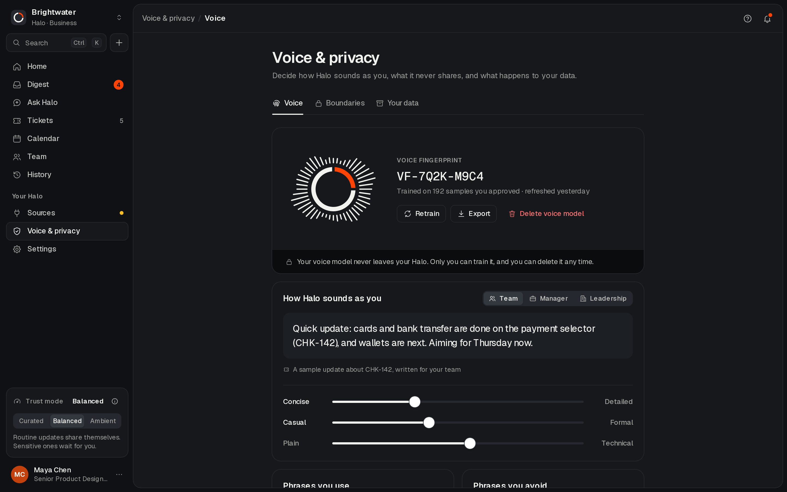
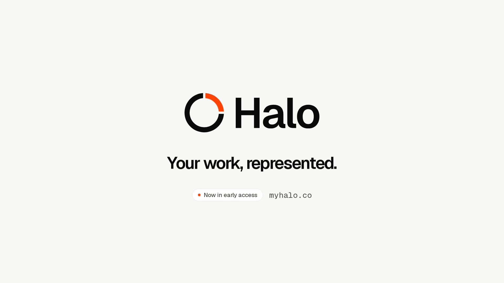

<p align="center"></p>

<h3 align="center">Your work, represented.</h3>

<p align="center">Halo turns the signal you already create (meetings, commits, design edits, tickets) into status updates in your own voice, sized for a teammate, a manager or an executive. So nobody writes another status update, or sits in another status meeting.</p>

<p align="center"><a href="https://indo1919.github.io/Halo/"><b>Open the live prototype</b></a> &nbsp;·&nbsp; <a href="film/halo-launch-film.mp4">Watch the film</a> &nbsp;·&nbsp; <a href="brand/Halo-Brand-Guidelines.pdf">Brand guidelines</a></p>



## Why Halo

> Because I’m tired of being paperwork for my own work.

Status updates, standups and ticket grooming quietly eat hours every week. Halo does that coordination work for you, and it is built on one rule: **it speaks for you, never about you.** It is an advocate for the individual contributor, not a monitoring tool for their manager.

- **Status that writes itself.** Halo reads only the sources you connect and drafts updates in your voice.
- **Same truth, right altitude.** One set of facts, written for your team, your manager or leadership.
- **One trust dial.** Curated (you approve everything), Balanced (routine updates share themselves, sensitive ones wait for a once-a-day digest) or Ambient (Halo shares as it goes, with a live activity log you can correct).
- **Visible restraint.** Private topics never leave your Halo, and when something is held back the product says so.
- **Meetings become plans.** When a meeting ends, Halo drafts the ticket and subtasks from what was decided, with three-point estimates adjusted to your pace.

## What’s in the prototype

| Area | Highlights |
| --- | --- |
| Home | What Halo is saying about you at three altitudes, today’s digest, schedule, work in progress, capacity, questions asked about you |
| Digest | Approve, edit, hold or keep private; trust modes change the whole screen state; activity log in Ambient |
| Ask Halo | Conversational answers in your voice with audience switching, streaming live AI, sources and rewrite |
| Tickets | List and board views with drag and drop, filters, subtasks, PERT estimate calculator with pace, time tracking |
| Calendar | Week and day views, focus time Halo protects, meetings Halo can cover, booking into open slots |
| Meeting recap | Summary, decisions and action items, then a drafted ticket with estimated, assignable subtasks |
| Team and History | Teammates’ published updates only, every update you shared, every question answered about you |
| Sources, Voice and privacy, Settings | Connector consent flow, voice fingerprint, private topics, audience visibility matrix, AI provider settings |
| First run | Marketing site, sign in, eight-step onboarding and a product tour |

Also: command palette (`⌘K` / `Ctrl K`), quick add (`N`), keyboard navigation (`G` then a letter, `?` for all shortcuts), light and dark themes, phone layouts, reduced motion, WCAG 2.2 AA contrast.

<p>






</p>

## Run it

Open `index.html` in any modern browser. It is a single self-contained file: no install, no server, no build.
The demo workspace, Brightwater, and everyone in it are fictional.

To host it, enable **GitHub Pages** for this repository (Settings, Pages, deploy from the `main` branch, root folder).

## Live AI

Halo picks the first available option, and every feature keeps working without any of them:

1. **Proxy (recommended for a public site).** Deploy the small Cloudflare Worker in [`worker/`](worker/README.md), then set its URL in `halo.config.js`. The API key stays in a Worker secret, never in the browser or the repo.
2. **Visitor key.** Anyone can paste their own Anthropic API key in Settings, AI. It stays in their browser only.
3. **Claude.** When Halo runs as a Claude artifact, it uses the viewer’s own Claude account.
4. **Demo answers.** Otherwise Halo answers from a built-in playbook drawn from the workspace, so every flow still works offline.

## Brand

The full identity lives in [`brand/`](brand): the mark (a precise ring with one Signal segment), lockups, app icons, favicons, social images, design tokens in W3C format, and the 24-page [brand guidelines](brand/Halo-Brand-Guidelines.pdf).

## Film

[](film/halo-launch-film.mp4)

`film/halo-launch-film.mp4` is the 84-second 16:9 launch film and `film/halo-launch-15s-vertical.mp4` is the 15-second 9:16 cut. Both are rendered frame by frame from `film/src/`, using the product’s own components.

## Project structure

```
index.html              Built, self-contained app (what GitHub Pages serves)
halo.config.js          Optional live AI proxy URL
src/                    App source: styles/ and js/ (core, shell, screens)
brand/                  Logo system, tokens, icons, social images, guidelines (HTML + PDF)
film/                   Launch film, vertical cut, poster, and the film source
worker/                 Cloudflare Worker that proxies Claude without exposing a key
tools/                  Build, screenshots, end-to-end walkthrough, brand and film renderers
docs/screenshots/       Images used in this README
```

See [CONTRIBUTING.md](CONTRIBUTING.md) for the architecture and design rules.

## License

© 2026 Halo. All rights reserved. Geist and Geist Mono are used under the SIL Open Font License 1.1. Connector logos belong to their owners and appear only to identify integrations. See [LICENSE](LICENSE).
